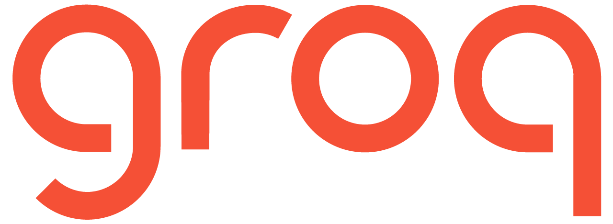
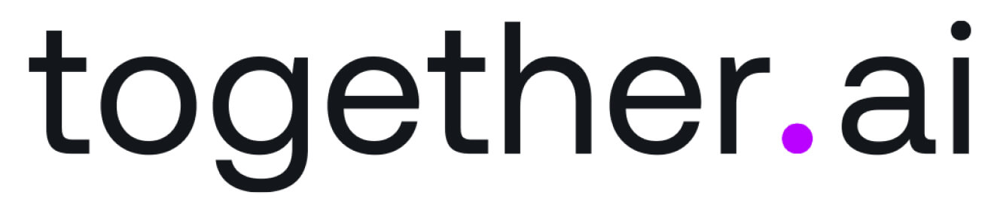

        
        Credits to <strong>Miguel Otero Pedrido | Senior ML / AI Engineer (<a href="https://www.linkedin.com/in/migueloteropedrido/">LinkedIn</a>) </strong> and <strong>Jesús Copado | Senior ML / AI Engineer </strong> (<a href="https://www.linkedin.com/in/copadojesus/">LinkedIn</a>)
    <h1 align="center">📱 AIsha 📱</h1>
    <h3 align="center">A Multimodal AI Agent</h3>

## Model Overview
AIsha is an AI Agent capable of:

* Receiving and sending Whatsapp messages(limited to test account as I am not a business) 📲
* Understanding your voice 🗣️
* Recognizing your images 🖼️
* Sending voice notes back 🎤
* Sharing updates about its "daily activities" 🚣
* Sending you images of its current activities 🖼️

## Getting started

I'm referring to the virtual environment creation, dependencies installation, `.env` file creation, etc. I know, it's very boring, but it's a necessary evil! 😅

All of this is detailed in the following doc: [GETTING STARTED.md](docs/GETTING_STARTED.md).

> Make sure you follow the instructions in the doc, as it's crucial for the code to work.
---

## How much is this going to cost me?

The awesome thing about this project is **you can run it on your own computer for free!**

The **free tiers** from Groq, ElevenLabs, Qdrant Cloud, and Together AI are more than enough to get you going.

If you want to try it out on Google Cloud Run, you can get a free account and get $300 in free credits. Even if you've already used up your free credits, Cloud Run is super cheap - so it will take just a buck or two for your experiments.

---

## The tech stack

<table>
  <tr>
    <th>Technology</th>
    <th>Description</th>
  </tr>
  <tr>
    <td></td>
    <td>Powering the project with Llama 3.3, Llama 3.2 Vision, and Whisper. Groq models are awesome (and fast!!)</td>
  </tr>
  <tr>
    <td></td>
    <td>Serving as the long-term database, enabling our agent to recall details you shared months ago.</td>
  </tr>
  <tr>
    <td></td>
    <td>Deploying your containers easily to Google Cloud Platform</td>
  </tr>
  <tr>
    <td></td>
    <td>Learn how to build production-ready LangGraph workflows</td>
  </tr>
  <tr>
    <td></td>
    <td>Amazing TTS models</td>
  </tr>
  <tr>
    <td></td>
    <td>Behind Ava's image generation process</td>
  </tr>
</table>

## Credits
Thanks to <strong>Miguel Otero Pedrido | Senior ML / AI Engineer (<a href="https://www.linkedin.com/in/migueloteropedrido/">LinkedIn</a>) </strong> and <strong>Jesús Copado | Senior ML / AI Engineer </strong> (<a href="https://www.linkedin.com/in/copadojesus/">LinkedIn</a>) for the guidance and documentation and especially the Jupyter Notebooks for helping me finish this project.

## License

This project is licensed under the MIT License - see the [LICENSE](LICENSE) file for details.

---

